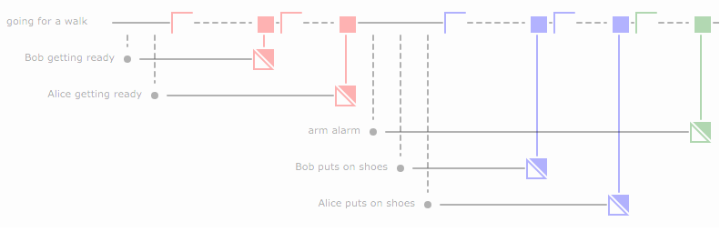

prd - PRoces Diagrams
=====================

Process Diagrams for concurrent processes that communicate via blocking
channels.

This is work in progress. Development is done in branch `dev`.

Examples
========

Going for a Walk
----------------

The following *proces diagram* is an analysis of the [daily walk trivial
concurrency
exercise](http://whipperstacker.com/2015/10/05/3-trivial-concurrency-exercises-for-the-confused-newbie-gopher/).



See `examples/goingFor.go` for the exact code. We've tried hard to make
the code readable:

``` {.go}
PrdStart(24, 6)

At(0, goingForAWalk).Starts("going for a walk")
At(1, goingForAWalk).Creates(BobGettingReady, "Bob getting ready")
At(2, goingForAWalk).Creates(AliceGettingReady, "Alice getting ready")

At(3, goingForAWalk).WantsToReceiveOn(gotReady)
At(6, BobGettingReady).WantsToSendOn(gotReady, "true")
At(7, goingForAWalk).WantsToReceiveOn(gotReady)
At(9, AliceGettingReady).WantsToSendOn(gotReady, "true")

At(10, goingForAWalk).Creates(armAlarm, "arm alarm")
At(11, goingForAWalk).Creates(BobPutsOnShoes, "Bob puts on shoes")
At(12, goingForAWalk).Creates(AlicePutsOnShoes, "Alice puts on shoes")

At(13, goingForAWalk).WantsToReceiveOn(putOnShoes)

At(16, BobPutsOnShoes).WantsToSendOn(putOnShoes, "true")
At(17, goingForAWalk).WantsToReceiveOn(putOnShoes)
At(19, AlicePutsOnShoes).WantsToSendOn(putOnShoes, "true")

At(20, goingForAWalk).WantsToReceiveOn(armedAlarm)
At(22, armAlarm).WantsToSendOn(armedAlarm, "true")
At(24, goingForAWalk).Terminates()

PrdEnd()
```

Eating Tapas
------------

This proces diagram is an analysis of the [eating tapas
exercise](http://whipperstacker.com/2015/10/05/3-trivial-concurrency-exercises-for-the-confused-newbie-gopher/):


See `examples/eatingTapas.go` for details on how to create this diagram.
