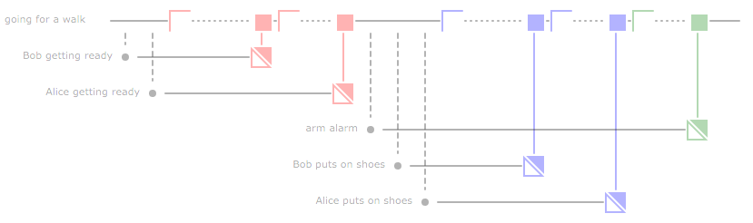
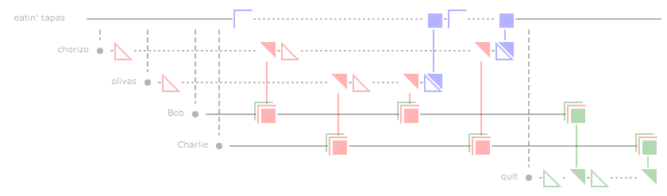

prd - PRoces Diagrams
=====================

Process Diagrams for concurrent processes that communicate via blocking
channels.

This is work in progress. Development is done in branch `dev`.

Proces Diagrams display several processes that are shown as horizontal lines.  At some point, these processes block because they want to receive or send on a channel.  As soon as communication is possible, the proces becomes active again.


The first line of symbols represent *send symbols*.
These symbols are an abstract-like `s` symbol (more like a flipped `z` really).  The first, open, symbol indicates a proces that wants to send on a channel.
The second, filled, symbol indicates an actual send on a channel.  In case a proces wants to send and communication is right away possible the third, combined, symbol is used.

By the way, symbol colors denote channels.  That is, you need a send and receive symbol of identical colors to make communication possible.

The second line contains *receive* sybols.  These are shaped after the `r`.

The third line contains symbols that indicate a proces that does not wait till communication is possible.

See the examples below.

Examples
========

Going for a Walk
----------------

The following *proces diagram* is an analysis of the [daily walk trivial
concurrency
exercise](http://whipperstacker.com/2015/10/05/3-trivial-concurrency-exercises-for-the-confused-newbie-gopher/).



See `examples/goingFor.go` for the exact code. We've tried hard to make
the code readable:

``` {.go}
PrdStart(24, 6)

At(0, goingForAWalk).Starts("going for a walk")
At(1, goingForAWalk).Creates(BobGettingReady, "Bob getting ready")
At(2, goingForAWalk).Creates(AliceGettingReady, "Alice getting ready")

At(3, goingForAWalk).WantsToReceiveOn(gotReady)
At(6, BobGettingReady).WantsToSendOn(gotReady, "true")
At(7, goingForAWalk).WantsToReceiveOn(gotReady)
At(9, AliceGettingReady).WantsToSendOn(gotReady, "true")

At(10, goingForAWalk).Creates(armAlarm, "arm alarm")
At(11, goingForAWalk).Creates(BobPutsOnShoes, "Bob puts on shoes")
At(12, goingForAWalk).Creates(AlicePutsOnShoes, "Alice puts on shoes")

At(13, goingForAWalk).WantsToReceiveOn(putOnShoes)

At(16, BobPutsOnShoes).WantsToSendOn(putOnShoes, "true")
At(17, goingForAWalk).WantsToReceiveOn(putOnShoes)
At(19, AlicePutsOnShoes).WantsToSendOn(putOnShoes, "true")

At(20, goingForAWalk).WantsToReceiveOn(armedAlarm)
At(22, armAlarm).WantsToSendOn(armedAlarm, "true")
At(24, goingForAWalk).Terminates()

PrdEnd()
```

Eating Tapas
------------

This proces diagram is an analysis of the [eating tapas
exercise](http://whipperstacker.com/2015/10/05/3-trivial-concurrency-exercises-for-the-confused-newbie-gopher/):



See `examples/eatingTapas.go` for details on how to create this diagram.

Internet Cafe
----

This final example is an analysis of the [internet cafe exercise](http://whipperstacker.com/2015/10/05/3-trivial-concurrency-exercises-for-the-confused-newbie-gopher/):


In this diagram the reception proces does not wait on a terminal.
This is indicated with the `||` symbol.  The first two tourist are
lucky enough to have a free terminal at their disposal.  The third
tourist, however has to wait until a terminal becomes available.

Until the third tourist can go online, proces reception both want to
receive tourist (red) as well as to send the third tourist to a free terminal (blue).
